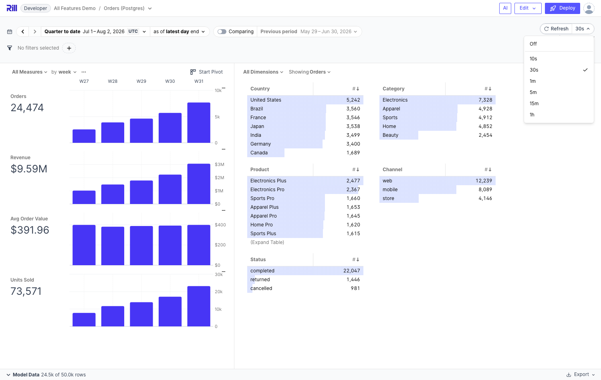

# 2. Dashboard Refresh Intervals

**Branch:** `avaitla/dashboard-refresh-intervals` (off `main`)

## What it does

A Grafana-style refresh control in the explore dashboard header: a manual "⟳ Refresh"
button plus an interval dropdown (Off, then a duration list — default
`5s 10s 30s 1m 5m 15m 30m 1h 2h 1d`), with a relative "Last refreshed …" caption
underneath that ticks and resets on every refresh.

- **Fixed interval**: a timer calls `invalidateMetricsViewData(queryClient, metricsViewName)`
  → every active dashboard query refetches
- The selection round-trips through the **`refresh` URL param**, cleaned when it equals
  the dashboard default (same convention as `tz`/`grain`)
- Available durations and the initial selection are **YAML-configurable**

(An earlier revision also had an `auto` mode that polled the metrics view watermark and
refreshed only on new data; it was removed by request — only explicit timers remain.)


*The refresh control with the interval dropdown open (Off + configured durations) and the "Last refreshed" caption.*

## Usage

```yaml
# explore yaml (standalone or inline in a metrics view)
refresh_intervals: ['5s', '30s', '1m', '5m', '15m', '1h']   # dropdown options
defaults:
  refresh_interval: 30s      # a duration, or "off" (default)
```

Parser validates durations (Go syntax plus a `d` day suffix, min 1s) and rejects
`off` inside `refresh_intervals` (it's always selectable).

## Key files

- `runtime/parser/parse_explore.go` — `refresh_intervals` + `defaults.refresh_interval`
  (+ `validateRefreshInterval`); proto: `ExploreSpec.refresh_intervals = 22`,
  `ExplorePreset.refresh_interval = 40`
- `web-common/src/features/dashboards/time-controls/RefreshSelector.svelte` (runes-mode)
  and `refresh-intervals.ts` (constants + duration parsing)
- URL-state pipeline: `url-params.ts`, `convertURLToExplorePreset.ts`,
  `convertPresetToExploreState.ts`, `convert-partial-explore-state-to-url-params.ts`,
  `getDefaultExplorePreset.ts`, `get-rill-default-explore-state.ts`,
  **and `get-explore-state-from-yaml-config.ts`** — the second state-init path that's easy
  to miss; without it the YAML default isn't applied on first load
- Wired into `filters/Filters.svelte` (header row 1, right-aligned)

## Tests

Parser: `TestExploreRefreshIntervals` in `runtime/parser/parse_explore_test.go`.
Frontend url-state/store suites: `cd web-common && npx vitest run src/features/dashboards/url-state src/features/dashboards/stores`.

## Demo runbook (port 9009)

Works with any OLAP engine. Fastest standalone demo uses DuckDB (no external deps);
the most impressive demo combines it with the Postgres connector branch (insert rows
live and watch a short interval pick them up) — for that, create a local merge of both
branches.

```bash
mkdir -p /tmp/refreshdemo/models /tmp/refreshdemo/metrics /tmp/refreshdemo/dashboards
cat > /tmp/refreshdemo/rill.yaml <<'EOF'
compiler: rillv1
display_name: Refresh Demo
EOF
cat > /tmp/refreshdemo/models/orders.sql <<'EOF'
SELECT TIMESTAMP '2026-05-01' + INTERVAL (i % 2200) HOUR AS ordered_at,
  ['United States','Germany','India','Brazil','Japan'][1 + i % 5] AS country,
  10 + (i % 37) * 3.5 AS revenue
FROM range(0, 50000) t(i)
EOF
cat > /tmp/refreshdemo/metrics/orders_metrics.yaml <<'EOF'
version: 1
type: metrics_view
model: orders
timeseries: ordered_at
dimensions:
  - column: country
measures:
  - name: total_orders
    expression: count(*)
explore:
  name: orders_explore
  refresh_intervals: ['5s', '30s', '1m', '5m', '15m', '1h']
  defaults:
    refresh_interval: 30s
EOF
cd /tmp/refreshdemo && /path/to/rill/rill start --no-open --port 9009 --port-grpc 49009
```

**What to show** at http://localhost:9009/explore/orders_explore:

- Selector defaults to **30s** (from YAML), dropdown lists the configured intervals with
  Off on top; "Last refreshed Just now" under the pill, ticking to "1 minute ago"
- Pick `5s` → URL becomes `?refresh=5s`; server log shows queries re-firing every 5s
  (`log_queries: true` on the connector makes this visible)
- Deep-link `?refresh=15m` → selector shows 15m
- Live data: with the Postgres merge, `INSERT` rows and watch totals update on the next
  tick — no reload. (With DuckDB, edit the model SQL to change data instead.)
- Manual ⟳ button resets the caption to "Just now"
