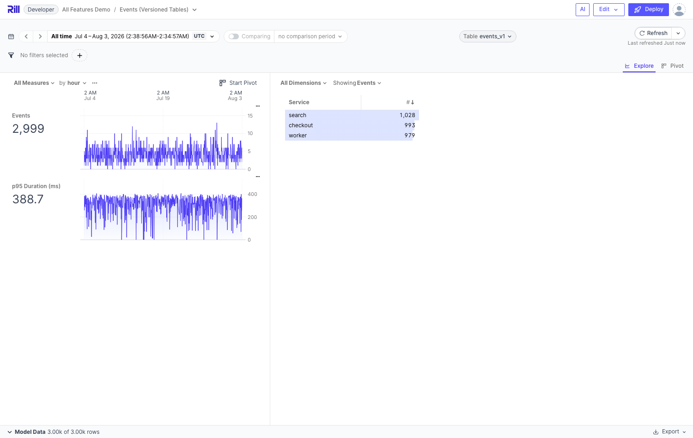

# 3. Skip Invalid Dimensions

**Branch:** `avaitla/skip-invalid-dimensions` (1 commit, off `main`; base for branches 5 & 6)

## What it does

Opt-in tolerance for schema drift: when a metrics view dimension references a column that
doesn't exist in the underlying table, the dimension is **excluded from the valid spec
with a reconcile warning** instead of the whole metrics view (and every dashboard on it)
failing. When the column comes back, the dimension reappears on the next reconcile.

Motivating use case: structured log events / schema-on-read sources where different rows
carry different fields and table schemas evolve as data arrives.

```yaml
type: metrics_view
skip_invalid_dimensions: true    # default false: typos still fail loudly
dimensions:
  - column: service
  - column: status_code   # not in the table yet? dashboard still works
```


*The events dashboard backed by `events_v1`, which lacks `http_method`/`region`: the missing dimensions are pruned instead of erroring (only the Service leaderboard remains).*

## How it works

- Proto: `MetricsViewSpec.skip_invalid_dimensions = 38`
- The metrics view reconciler (`runtime/reconcilers/metrics_view.go`) previously flattened
  every validation error into a fatal error (`State.ValidSpec = nil`). Now, when the flag
  is set and validation yields **only dimension errors**, `pruneInvalidDimensions` clones
  the spec, removes the failing dimensions by index, and **re-validates** (bounded to 5
  passes, since validation short-circuits and later errors can be masked). The pruned
  clone becomes `State.ValidSpec`; `mv.Spec` keeps all declared dimensions.
- Warnings surface via `ReconcileResult.Warnings` → `meta.reconcileWarnings`
- Any non-dimension error (bad measure, bad time dimension, security rules) still fails
  hard, as does everything when the flag is off
- **Zero frontend changes needed**: the dashboard error page only shows when there's no
  valid spec (`isExploreErrored`), and explores with `dimensions: '*'` selectors resolve
  against the pruned valid spec automatically. Explores with an explicit dimension list
  naming a pruned dimension will still error — expected.

## Tests

`TestMetricsViewSkipInvalidDimensions` in `runtime/reconcilers/metrics_view_test.go`:
strict mv fails with the column name in the error; flagged mv serves `[time, service]`
with the two missing columns in `reconcileWarnings`.

## Demo runbook (port 9009)

DuckDB-only, no external deps:

```bash
mkdir -p /tmp/skipdemo
cat > /tmp/skipdemo/rill.yaml <<'EOF'
compiler: rillv1
EOF
cat > /tmp/skipdemo/logs.sql <<'EOF'
SELECT '2026-08-01T10:00:00Z'::TIMESTAMP + INTERVAL (i) MINUTE AS time,
  ['checkout','search','worker'][1 + i % 3] AS service, 1 AS num
FROM range(0, 500) t(i)
EOF
cat > /tmp/skipdemo/mv.yaml <<'EOF'
type: metrics_view
model: logs
timeseries: time
skip_invalid_dimensions: true
dimensions:
- column: service
- column: status_code
- column: log_level
measures:
- name: events
  expression: count(*)
EOF
cd /tmp/skipdemo && /path/to/rill/rill start --no-open --port 9009 --port-grpc 49009
```

**What to show:**

1. Dashboard at http://localhost:9009/explore/mv renders fine with just the `service`
   leaderboard — `status_code` and `log_level` are declared but missing from the table
2. The warnings:
   `curl -s localhost:9009/v1/instances/default/resources | jq '.resources[] | select(.meta.name.kind|endswith("MetricsView")) | .meta.reconcileWarnings'`
   → `["skipped dimension \"status_code\": ...", "skipped dimension \"log_level\": ..."]`
3. Schema evolution: edit `logs.sql` to add
   `, ['INFO','WARN','ERROR'][1 + i % 3] AS log_level` — the `log_level` leaderboard
   appears on the next reconcile, no YAML change
4. Counter-demo: remove `skip_invalid_dimensions` → the whole dashboard errors with
   "column \"status_code\" not found in table"
