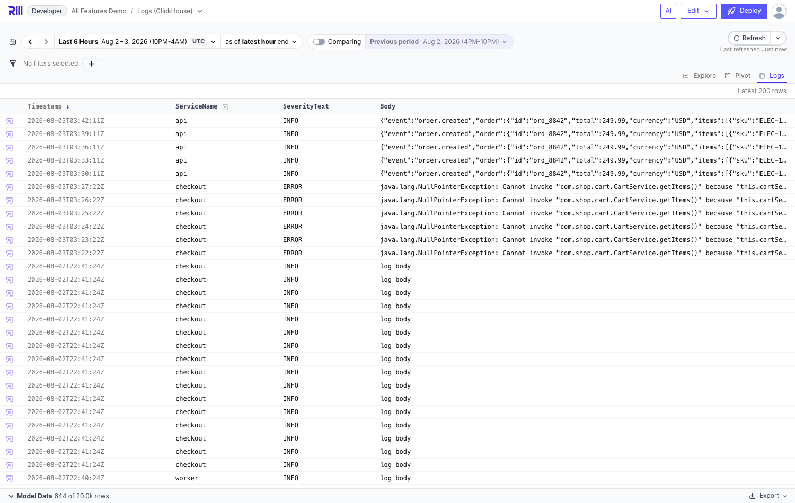

# 8. Logs Web View (Live Log Tail)

**Branch:** `avaitla/logs-view` (off `main`)

## What it does

A **Logs tab** next to Explore/Pivot showing the underlying raw rows for the current
filters and time range, newest first (limit 200), with expandable per-row detail
showing every column. Combined with `refresh_intervals` (branch 2) this is a tailing
log viewer: the observability loop becomes aggregate → filter → **read the actual log
lines** without leaving Rill.

```yaml
type: explore
metrics_view: logs
logs_view: true
logs_view_columns: [Timestamp, ServiceName, SeverityText, Body]   # optional; default all
```



## How it works

- Proto: `ExploreSpec.logs_view = 24`, `logs_view_columns = 25`,
  `ExploreWebView.EXPLORE_WEB_VIEW_LOGS = 5`, ui `ActivePage.LOGS = 5`
- URL state: `view=logs` web view param (same pipeline as `pivot`/`tdd`)
- Data: `QueryService.MetricsViewRows` with the dashboard's where filter and time
  range, sorted by the time dimension descending. The runtime previously rejected
  `sort` on raw-rows queries; that restriction is lifted (with `SELECT *`, any
  underlying column is in scope for ORDER BY)
- UI: `web-common/src/features/dashboards/logs-view/LogsView.svelte` (monospace table,
  sticky header, row click expands a detail grid of all fields incl. Map columns).
  Columns are **sortable** (click a header; defaults to time desc). Multiline values
  such as stack traces show their first line with a `(+N lines)` hint in the row and
  render with preserved newlines in the detail. Cells of columns backed by a dimension
  with `links` get the same labeled link menu (all-features branch);
  `TabBar.svelte` gains the tab, `Dashboard.svelte` renders the view for
  `ActivePage.LOGS`

## Demo

All-features demo: Logs (ClickHouse) explore and both RED explores have
`logs_view: true`. Filters and time range apply live; pick a refresh interval to tail.
